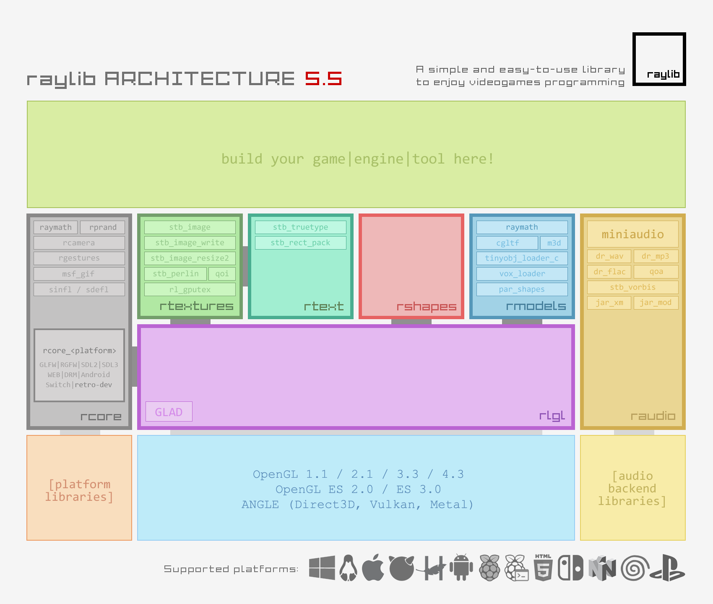

---
layout:
  width: wide
  title:
    visible: true
  description:
    visible: false
  tableOfContents:
    visible: true
  outline:
    visible: true
  pagination:
    visible: false
  metadata:
    visible: true
---

# Arquitetura do Raylib

## Os Componentes da Raylib

A Raylib é dividida em grandes blocos de códigos chamados de módulos, onde cada um tem seu papel específico. Ou seja, se você precisar de alguma funcionalidade em seu programa, você procurará o bloco específico dessa funcionalidade e depois a função/código que deverá implementar, facilitando a construção do programa como um todo.

E mesmo a Raylib sendo constituída de vários blocos, todos eles são unificados em uma única biblioteca no seu código: `#include "raylib.h"`.

Com isso, vamos destrinchar cada módulo dessa ferramenta.

<figure><figcaption></figcaption></figure>

### 1. `rcore` - O Núcleo

O `rcore` funciona como o cérebro de toda a operação da Raylib. Ele é quem gerencia as janelas, os eventos do sistema, as entradas do usuário (teclado, mouse, gamepad) e o loop principal do jogo.

#### Principais Funções:

* `InitWindow()`: Cria a janela e inicializa o contexto gráfico. É a primeira coisa que você chama.
* `WindowShouldClose()`: Verifica se o usuário tentou fechar a janela (clicando no 'X' ou pressionando ESC).
* `BeginDrawing()` e `EndDrawing()`: Marcam o início e o fim do processo de desenho na tela.
* `SetTargetFPS()`: Define a taxa de quadros por segundo (FPS) desejada.
* `IsKeyDown()`, `IsMouseButtonPressed()`: Funções para verificar a entrada do teclado e do mouse.
* `GetMousePosition()`: Retorna a posição do cursor do mouse.

### 2. `rshapes` - O Artista

Precisa desenhar alguma coisa na tela? Um círculo? Um quadrado? Um único pixel? Esse é o módulo responsável por montar e mostrar objetos simples na tela. É o que vai dar o visual da sua aplicação.

#### Principais Funções:

* `DrawPixel()`: Desenha um único pixel.
* `DrawLine()`: Desenha uma linha entre dois pontos.
* `DrawCircle()`: Desenha um círculo (contorno ou preenchido).
* `DrawRectangle()`: Desenha um retângulo (contorno ou preenchido).
* `DrawTriangle()`: Desenha um triângulo.

### 3. `rtextures` - O Fotógrafo

Enquanto o `rshapes` cria coisas, o `rtextures` as carrega. Quando formas geométricas não são suficientes, usamos o módulo de texturas para carregar e desenhar imagens (sprites).

#### Principais Funções:

* `LoadTexture()`: Carrega um arquivo de imagem (como `.png` ou `.jpg`) do disco para a memória da placa de vídeo.
* `UnloadTexture()`: Libera a textura da memória quando você não precisa mais dela.
* `DrawTexture()`: Desenha uma textura carregada na tela.
* `DrawTextureV()`: Desenha uma textura usando um `Vector2` para a posição.
* `DrawTextureRec()`: Desenha uma parte específica de uma textura (essencial para _Sprite Sheets_).

### 4. `rtext` - O Escriba

Precisa escrever um texto de qualquer tipo ou tamanho? O `rtext` cuida disso pra você.

#### Principais Funções:

* `LoadFont()`: Carrega um arquivo de fonte (como `.ttf` ou `.otf`).
* `DrawText()`: Desenha uma string de texto na tela usando a fonte padrão.
* `DrawTextEx()`: Desenha um texto permitindo especificar a fonte, o tamanho e o espaçamento.
* `MeasureText()`: Retorna a largura em pixels de um texto, útil para centralizá-lo.

### 5. `raudio` - O Músico

_"Sem música, a vida seria um erro"_ - como já dizia Nietzsche. Este módulo serve para implementar músicas e sons no seu programa, desde Faroeste Caboclo até um efeito sonoro de pulo. O módulo de áudio gerencia dois tipos de som:

* Sons curtos (`Sound`): Carregados inteiramente na memória, ideais para efeitos sonoros (pulos, tiros, cliques).
* Músicas (`Music`): Tocadas diretamente do arquivo (_streaming_), ideais para trilhas sonoras longas, pois consomem menos memória RAM.

#### Principais Funções:

* `InitAudioDevice()`: Inicializa o dispositivo de áudio.
* `LoadSound()`: Carrega um efeito sonoro (ex: `.wav`, `.ogg`).
* `PlaySound()`: Toca um som carregado.
* `LoadMusicStream()`: Carrega uma música para ser tocada via _streaming_ (ex: `.mp3`).
* `PlayMusicStream()`: Inicia a reprodução da música.
* `UpdateMusicStream()`: Deve ser chamado a cada frame para continuar a reprodução da música.

### 6. `rmodels` - O Escultor

A Raylib permite que você se aventure além da segunda dimensão. O `rmodels` é um módulo completo para carregar e renderizar modelos 3D, gerenciar câmeras e iluminação básica.

#### Principais Funções:

* `LoadModel()`: Carrega um modelo 3D de um arquivo (ex: `.obj`, `.gltf`).
* `DrawModel()`: Desenha um modelo no espaço 3D.
* `DrawGrid()`: Desenha um grid para ajudar na orientação espacial.
* `BeginMode3D()` e `EndMode3D()`: Ativam e desativam o modo de desenho 3D, exigindo uma câmera.

### 7. `raymath` - O Contador

Uma biblioteca poderosa de matemática vetorial. Fornece todas as funções e estruturas para trabalhar com `Vector2`, `Vector3`, `Matrix`, Quaternions, etc. Você a usará constantemente, mesmo que indiretamente.

### 8. `rlgl` - O Bastidor

Uma camada de abstração sobre o OpenGL. É o que permite à Raylib desenhar tudo na tela de forma eficiente. Você raramente (ou nunca) precisará usar este módulo diretamente.

#### Resumo Rápido

| Módulo      | Responsabilidade Principal                           |
| ----------- | ---------------------------------------------------- |
| `rcore`     | Janela, Loop do Jogo, Teclado, Mouse, Gamepad.       |
| `rshapes`   | Desenho de formas 2D (círculos, retângulos, linhas). |
| `rtextures` | Carregamento e desenho de imagens e sprites.         |
| `rtext`     | Renderização de texto e gerenciamento de fontes.     |
| `raudio`    | Reprodução de efeitos sonoros e músicas.             |
| `rmodels`   | Carregamento e renderização de objetos 3D.           |
| `raymath`   | Funções matemáticas para jogos (vetores, matrizes).  |
