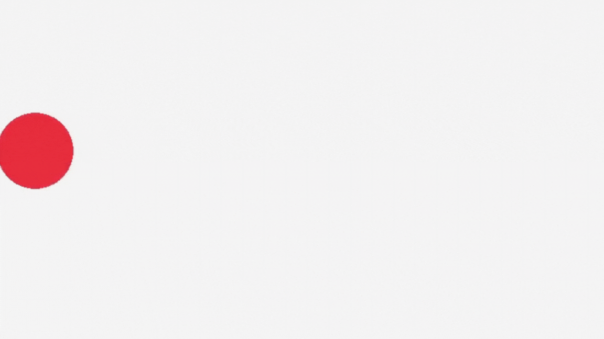

# Tutorial 4 - Movendo e Colidindo

Vamos dar um passo além das formas estáticas. Vamos criar um objeto que se move sozinho e ensiná-lo a interagir com o ambiente, primeiro ricocheteando nas paredes e depois detectando a presença de outros objetos.

***

### Passo 1 - Ele esta vivo!

Nosso primeiro objetivo é fazer um circulo se mover de um lado para o outro da tela, sem intervenção do jogador.

#### Preparando as variaveis

Antes de qualquer coisa, temos que declarar as variaveis que vamos usar. A partir de agora, conforme nossos programas crescem em tamanho vamos separa-los em blocos, esse primeiro bloco sera o bloco de **Inicializacao,** que acontece antes do nosso loop principa&#x6C;**.**

```
// --- Inicializacao ---
// Configuração da Janela
const int screenWidth = 800;
const int screenHeight = 450;
InitWindow(screenWidth, screenHeight, "Tutorial 3 - Movimento Automático e Colisões");
SetTargetFPS(60);

// Posições e Lógica da Caixa
Vector2 boxPosition = { 100, 200 }; // Posição inicial
Vector2 boxSpeed = { 4.0f, 0.0f }; // Velocidade: 4 pixels/frame no eixo X, 0 no eixo Y
```

Vamos analisar as novidades:

* `Vector2 boxPosition`: Armazena a posição atual X e Y da nossa caixa.
* `Vector2 boxSpeed`: Esta é a grande mudança. Em vez de um único número (`float`), estamos usando um `Vector2` para a velocidade. Isso nos permite controlar a velocidade nos eixos X (`boxSpeed.x`) e Y (`boxSpeed.y`) de forma independente. No momento, a velocidade Y é zero, então o movimento será puramente horizontal.

#### Atualizando a posicao

Fazer o bloco se mover sozinho e bem simples: a cada frame, simplesmente aplicamos a velocidade à posição. Esse passo vai ficar em um bloco dentro do nosso loop principal chamado **Atualizacao da L'ogica.**

```
// --- Atualização da Lógica ---
boxPosition.x += boxSpeed.x; // Movimento da Caixa
```

* `boxPosition.x += boxSpeed.x`: A cada frame, a posição X da caixa é atualizada, somando-se o valor da sua velocidade X. Como o loop roda 60 vezes por segundo, a caixa se moverá 4 pixels para a direita, 60 vezes por segundo.

#### Desenhando o Movimento

O Bloco de **Desenho** apenas desenha a caixa na sua nova posição, que foi calculada no Bloco de Atualização.

```
// --- Desenho ---
BeginDrawing();
            ClearBackground(RAYWHITE);
            DrawCircle(boxPosition.x, boxPosition.y, 50, RED); // Desenha a caixa
EndDrawing();
```

Com isso voce vai ter algo assim:

<figure><figcaption></figcaption></figure>

***

### Passo 2 - Ricochete

Do jeito que esta, nossa figura segue em velocidade constante para a direita ate o infinito, saindo da tela. Vamos contornar isso adicionando uma colisao com a borda da janela.

```
// --- Lógica ---
// ...

// Ricocheteia a bola na borda na janela
if ((boxPosition.x + 50 >= screenWidth) || (boxPosition.x <= 50)){
        boxSpeed.x *= -1;
}
```

Vamos entender o que esse novo trecho faz:

* `if ((boxPosition.x + 50 >= screenWidth) || (boxPosition.x <= 0))`: Esta condição verifica duas coisas:
  1. `boxPosition.x + 50 >= screenWidth`: Se a posição do canto esquerdo da caixa (`boxPosition.x`) somada à sua largura (`50`) ultrapassar a borda direita da tela.
  2. `boxPosition.x <= 0`: Se a posição do canto esquerdo da caixa ultrapassar a borda esquerda.
  3. O `||` ("OU") faz com que a condição seja verdadeira se qualquer uma dessas situações ocorrer.
* `boxSpeed.x *= -1`: Esta é a lógica do ricochete. Multiplicar a velocidade por `-1` inverte o seu sinal. Se a velocidade era `4.0f` (indo para a direita), ela se torna `-4.0f` (indo para a esquerda), e vice-versa.

<figure><figcaption></figcaption></figure>

### Passo 3 - Colindo Objetos

Agora, vamos adicionar um obstáculo estático e detectar quando nossa caixa em movimento colide com ele.

#### Preparando as Variaveis

```
// --- Inicialização ---
//...

// Colisões/Flags
Rectangle obstacleRec = { 300, 100, 80, 250 }; // Posição e tamanho do obstáculo
bool collision = false;
```

#### Logica da Colisao

```
// --- Lógica ---
//...
        
Rectangle boxRec = { boxPosition.x, boxPosition.y, 50, 50 };

if (CheckCollisionRecs(boxRec, obstacleRec)){
        collision = true;
} else{
        collision = false;
}
```

* `Rectangle boxRec`: Criamos um `Rectangle` para nossa caixa móvel dentro do loop, pois suas coordenadas `x` e `y` são atualizadas a cada frame.
* `CheckCollisionRecs(rec1, rec2)`: Esta função da Raylib retorna `true` se os dois retângulos estiverem se sobrepondo. Nós usamos o resultado para atualizar nossa flag `collision`.

#### Feedback Visual

Vamos usar a flag `collision` para mudar a cor da nossa caixa móvel.

```
// --- Desenho ---
BeginDrawing();
    ClearBackground(RAYWHITE);
    
    // Se houve colisão, o circulo fica VERDE, senão, fica VERMELHO
    if (collision){
        DrawCircleV(boxPosition, 50, GREEN);
    } else{
        DrawCircleV(boxPosition, 50, RED);
    }

    // Desenha o obstáculo
    DrawRectangleRec(obstacleRec, BLUE);
EndDrawing();
```

Agora, a cor da nossa caixa principal depende do estado da flag `collision`, dando um feedback visual imediato quando o toque acontece.

<figure><figcaption></figcaption></figure>

### Codigo Final

```
#include "raylib.h"

int main(){
    // --- Inicialização ---
    const int screenWidth = 800;
    const int screenHeight = 450;
    InitWindow(screenWidth, screenHeight, "Tutorial 4 - Movimento Automático e Colisões");
    SetTargetFPS(60);

    Vector2 boxPosition = { 50, 200 }; // Posição inicial
    Vector2 boxSpeed = { 4.0f, 0.0f }; // Velocidade: 4 pixels/frame no eixo X, 0 no eixo Y

    // Colisões/Flags
    Rectangle obstacleRec = { 300, 100, 80, 250 }; // Posição e tamanho do obstáculo
    bool collision = false;

    while (!WindowShouldClose())
    {
        // --- Lógica ---
        boxPosition.x += boxSpeed.x; // Move a caixa

        // Ricocheteia a bola na borda na janela
        if ((boxPosition.x + 50 >= screenWidth) || (boxPosition.x <= 50)){
            boxSpeed.x *= -1;
        }

        Rectangle boxRec = { boxPosition.x, boxPosition.y, 50, 50 };

        if (CheckCollisionRecs(boxRec, obstacleRec)){
            collision = true;
        } else{
            collision = false;
        }

        // --- Desenho ---
        BeginDrawing();
            ClearBackground(RAYWHITE);
    
            // Se houve colisão, o circulo fica VERDE, senão, fica VERMELHO
            if (collision){
                DrawCircleV(boxPosition, 50, GREEN);
            } else{
                DrawCircleV(boxPosition, 50, RED);
            }

            // Desenha o obstáculo
            DrawRectangleRec(obstacleRec, BLUE);
        EndDrawing();
    }

    CloseWindow();
    return 0;
}
```

#### Hora de Experimentar

* Adicione movimento vertical! Mude o `boxSpeed.y` para um valor diferente de zero e adicione a lógica de ricochete para as paredes superior e inferior.
* O que acontece se a caixa "nascer" já colidindo com o obstáculo? Como você poderia resolver isso?
* Crie múltiplos obstáculos usando um array de `Rectangle` e verifique a colisão com todos eles usando um loop `for`.
